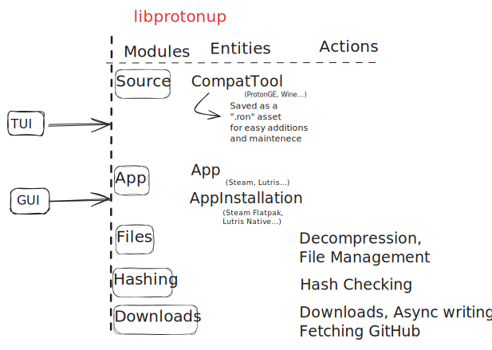

# Protonup-rs/libprotonup Documentation

## High Level Architectural Overview



## Overview

ProtonUp-rs is a tool for managing compatibility tools (like Proton, WineGE) for apps like Steam and Lutris. It handles downloading, verifying, and installing tools from GitHub repositories.

---

## Core Components

### 1. Applications (`apps` Module)

#### `App` Enum

Represents supported applications:

```rust
pub enum App {
    Steam,
    Lutris,
    Custom(String)  // User-provided path
}
```

- **Key Methods**:
  - `default_compatibility_tool()`: Returns default tool (e.g., GEProton for Steam)
  - `detect_installation_method()`: Checks for Native/Flatpak installations
  - `subfolder_for_tool()`: Gets tool-specific subfolder (e.g., "runners/wine" for Lutris Wine tools)

#### `AppInstallations` Enum

Tracks installation variants:

```rust
pub enum AppInstallations {
    Steam, SteamFlatpak,
    Lutris, LutrisFlatpak,
    Custom(String)
}
```

- **Key Methods**:
  - `installation_dir()`: Builds full path for tool installation
  - `list_installed_versions()`: Lists installed tool versions
  - `app_base_dir()`: Returns root directory (e.g., `~/.steam/steam`)


Adding support to new tools should be a simple process.
If it has a default installation folder, the existing methods should work to detect it.

---

### 2. Compatibility Tools (`sources` Module)

#### `CompatTool` Struct

Defines compatibility tool sources:

```rust
pub struct CompatTool {
    pub name: String,               // e.g., "GEProton"
    pub forge: Forge,               // Source (GitHub)
    pub repository_account: String, // "GloriousEggroll"
    pub repository_name: String,    // "proton-ge-custom"
    pub tool_type: ToolType,        // WineBased/Runtime
    // ... other fields
}
```

- **Key Methods**:
  - `installation_name()`: Processes version strings (e.g., "v1.5" → "dxvk-1.5")
  - `filter_asset()`: Matches release assets using regex

**Preconfigured Tools**:

- GEProton, WineGE, Luxtorpeda, Boxtron, DXVK, etc.

Adding new tools should be a simple process. All data related to them are stored in the `sources.ron` file.
Functionality like templating is optional, and not necessary for all tools.

---

### 3. Release Handling (`downloads` Module)

#### `Release` Struct

```rust
pub struct Release {
    pub tag_name: String,  // Version tag
    pub assets: Vec<Asset> // Downloadable files
}
```

- `get_download_info()`: Creates `Download` object with URLs and hashes

#### `Download` Struct

```rust
pub struct Download {
    pub file_name: String,
    pub download_url: String,
    pub hash_sum: Option<HashSums>, // SHA256/512
    // ... other fields
}
```

**Key Functions**:

- `list_releases()`: Fetches GitHub releases
- `download_to_async_write()`: Downloads with progress tracking

---

### 4. File Operations (`files` Module)

**Key Features**:

- **Decompression**: Supports `.tar.gz`, `.tar.xz`, `.tar.zst`
- **Directory Management**:

  ```rust
  async fn list_folders_in_path(path: &PathBuf) -> Result<Vec<String>>
  async fn remove_dir_all(path: &PathBuf) -> Result<()>
  ```

- **Installation**:

  ```rust
  async fn unpack_file(reader: impl AsyncRead, install_path: &Path)
  ```

---

### 5. Security (`hashing` Module)

**Hash Verification**:

```rust
pub async fn hash_check_file(
    file_name: &str,
    file: &mut impl AsyncRead,
    git_hash: HashSums
) -> Result<bool>
```

- Supports SHA-256 and SHA-512
- Automatically verifies against checksum files from GitHub

---

## Utilities

### Path Expansion

```rust
utils::expand_tilde("~/.steam") // => "/home/user/.steam"
```

### Constants

```rust
pub const DEFAULT_STEAM_TOOL: &str = "GEProton";
pub const DEFAULT_LUTRIS_TOOL: &str = "WineGE";
pub const USER_AGENT: &str = "protoup-rs/vX.Y.Z";
```

---

## Workflow Example

1. **Detect Installed Apps**:

   ```rust
   let installed = list_installed_apps().await;
   // e.g., [AppInstallations::Steam]
   ```

2. **Fetch Releases**:

   ```rust
   let releases = list_releases(&compat_tool).await?;
   ```

3. **Download & Verify**:

   ```rust
   download_to_async_write(&url, &mut file).await?;
   hash_check_file(file_name, &mut file, expected_hash).await?;
   ```

4. **Install**:

   ```rust
   unpack_file(reader, install_path).await?;
   ```
