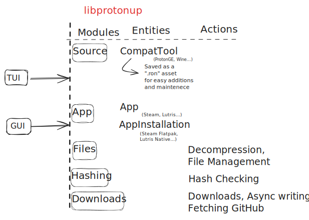

# Protonup-rs/libprotonup Documentation

## High Level Architectural Overview



## Overview

ProtonUp-rs is a tool for managing compatibility tools (like GEProton, and Luxtorpeda) for apps like Steam and Lutris. It handles downloading, verifying, and installing tools from GitHub repositories.

---

## Usage Modes

### Interactive TUI Mode

Run without arguments to start the interactive text-based user interface:

```bash
protonup-rs
```

### CLI Mode (Non-Interactive)

Use CLI arguments for automation or scripting. When any of `--tool`, `--version`, or `--for` is provided, the TUI is bypassed:

```bash
# Install latest GEProton for Steam (auto-detected)
protonup-rs --tool GEProton

# Install specific version for Lutris
protonup-rs --tool GEProton --version 8.26 --for lutris

# Install to custom path
protonup-rs --tool GEProton --version latest --for ~/.local/steam

# Force overwrite existing installation
protonup-rs --tool GEProton --for steam --force
```

#### CLI Arguments

| Argument | Description |
|----------|-------------|
| `--tool <TOOL>` | Compatibility tool name (e.g., `GEProton`, `Luxtorpeda`) |
| `--version <VERSION>` | Version to install. Use `latest` for the latest version |
| `--for <TARGET>` | Installation target: `steam`, `lutris`, or a custom path |
| `--force` | Overwrite existing installations |
| `--quick-download` | Auto-detect apps and install default tools |

**`--for` argument behavior:**
- `steam` / `Steam` (case-insensitive) - Install to Steam (Native or Flatpak)
- `lutris` / `Lutris` (case-insensitive) - Install to Lutris (Native or Flatpak)
- `<path>` - Any other value is treated as a custom installation path (relative or absolute)
- Omitted - Auto-detects based on the tool's `compatible_applications` and what's installed

**Auto-detection logic:**
1. When `--tool` is specified, the tool's `compatible_applications` list is checked
2. Compatible apps are checked in order (Steam first, then Lutris, based on the tool's configuration)
3. First installed compatible app is selected
4. If no compatible apps are found, an error is shown

---

## Core Components

### 1. Applications (`apps` Module)

#### `App` Enum

Represents supported applications:

```rust
pub enum App {
    Steam,
    Lutris,
    Custom(String)  // User-provided path
}
```

- **Key Methods**:
  - `default_compatibility_tool()`: Returns default tool (e.g., GEProton for Steam)
  - `detect_installation_method()`: Checks for Native/Flatpak installations
  - `subfolder_for_tool()`: Gets tool-specific subfolder (e.g., "runners/wine" for Lutris Wine tools)

#### `AppInstallations` Enum

Tracks installation variants:

```rust
pub enum AppInstallations {
    Steam, SteamFlatpak,
    Lutris, LutrisFlatpak,
    Custom(String)
}
```

- **Key Methods**:
  - `installation_dir()`: Builds full path for tool installation
  - `list_installed_versions()`: Lists installed tool versions
  - `app_base_dir()`: Returns root directory (e.g., `~/.steam/steam`)

Adding support to new tools should be a simple process.
If it has a default installation folder, the existing methods should work to detect it.

---

### 2. Compatibility Tools (`sources` Module)

#### `CompatTool` Struct

Defines compatibility tool sources:

```rust
pub struct CompatTool {
    pub name: String,               // e.g., "GEProton"
    pub forge: Forge,               // Source (GitHub)
    pub repository_account: String, // "GloriousEggroll"
    pub repository_name: String,    // "proton-ge-custom"
    pub tool_type: ToolType,        // WineBased/Runtime
    // ... other fields
}
```

- **Key Methods**:
  - `installation_name()`: Processes version strings (e.g., "v1.5" → "dxvk-1.5")
  - `filter_asset()`: Matches release assets using regex

**Preconfigured Tools**:

- GEProton, Luxtorpeda, Boxtron, DXVK, etc.

Adding new tools should be a simple process. All data related to them are stored in the [sources.ron](libprotonup/src/sources.ron) file.
Functionality like templating is optional, and not necessary for all tools.

---

### 3. Release Handling (`downloads` Module)

#### `Release` Struct

```rust
pub struct Release {
    pub tag_name: String,  // Version tag
    pub assets: Vec<Asset> // Downloadable files
}
```

- `get_download_info()`: Creates `Download` object with URLs and hashes

#### `Download` Struct

```rust
pub struct Download {
    pub file_name: String,
    pub download_url: String,
    pub hash_sum: Option<HashSums>, // SHA256/512
    // ... other fields
}
```

**Key Functions**:

- `list_releases()`: Fetches GitHub releases
- `download_to_async_write()`: Downloads with progress tracking

---

### 4. File Operations (`files` Module)

**Key Features**:

- **Decompression**: Supports `.tar.gz`, `.tar.xz`, `.tar.zst`
- **Directory Management**:

  ```rust
  async fn list_folders_in_path(path: &PathBuf) -> Result<Vec<String>>
  async fn remove_dir_all(path: &PathBuf) -> Result<()>
  ```

- **Installation**:

  ```rust
  async fn unpack_file(reader: impl AsyncRead, install_path: &Path)
  ```

---

### 5. Security (`hashing` Module)

**Hash Verification**:

```rust
pub async fn hash_check_file(
    file_name: &str,
    file: &mut impl AsyncRead,
    git_hash: HashSums
) -> Result<bool>
```

- Supports SHA-256 and SHA-512
- Automatically verifies against checksum files from GitHub

---

## Utilities

### Path Expansion

```rust
utils::expand_tilde("~/.steam") // => "/home/user/.steam"
```

### Constants

```rust
pub const DEFAULT_STEAM_TOOL: &str = "GEProton";
pub const DEFAULT_LUTRIS_TOOL: &str = "GEProton";
pub const USER_AGENT: &str = "protoup-rs/vX.Y.Z";
```

---

## Workflow Example

1. **Detect Installed Apps**:

   ```rust
   let installed = list_installed_apps().await;
   // e.g., [AppInstallations::Steam]
   ```

2. **Fetch Releases**:

   ```rust
   let releases = list_releases(&compat_tool).await?;
   ```

3. **Download & Verify**:

   ```rust
   download_to_async_write(&url, &mut file).await?;
   hash_check_file(file_name, &mut file, expected_hash).await?;
   ```

4. **Install**:

   ```rust
   unpack_file(reader, install_path).await?;
   ```
